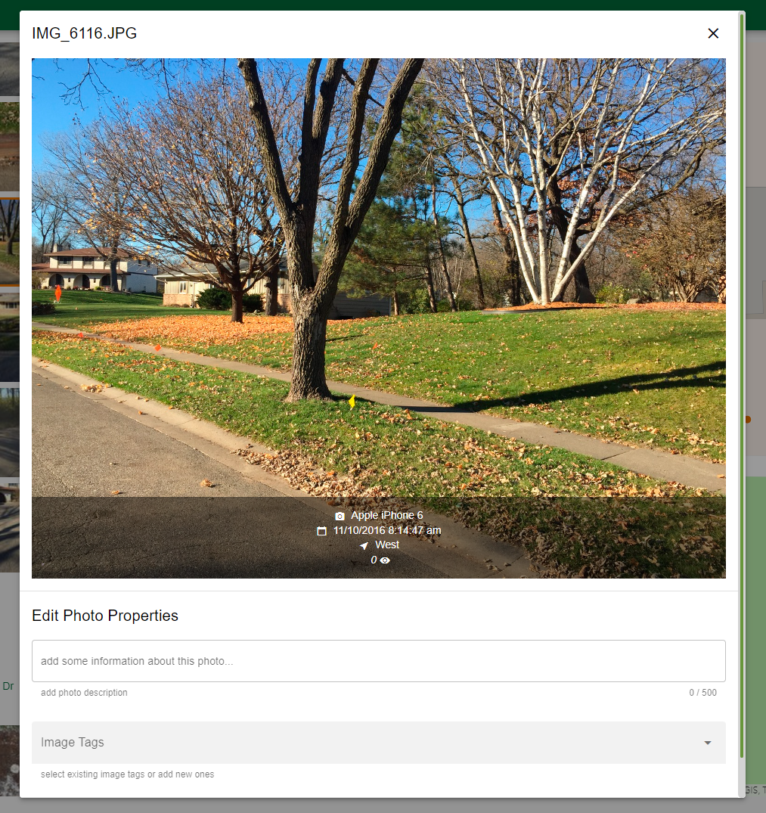
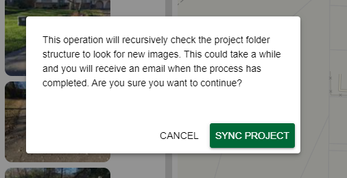
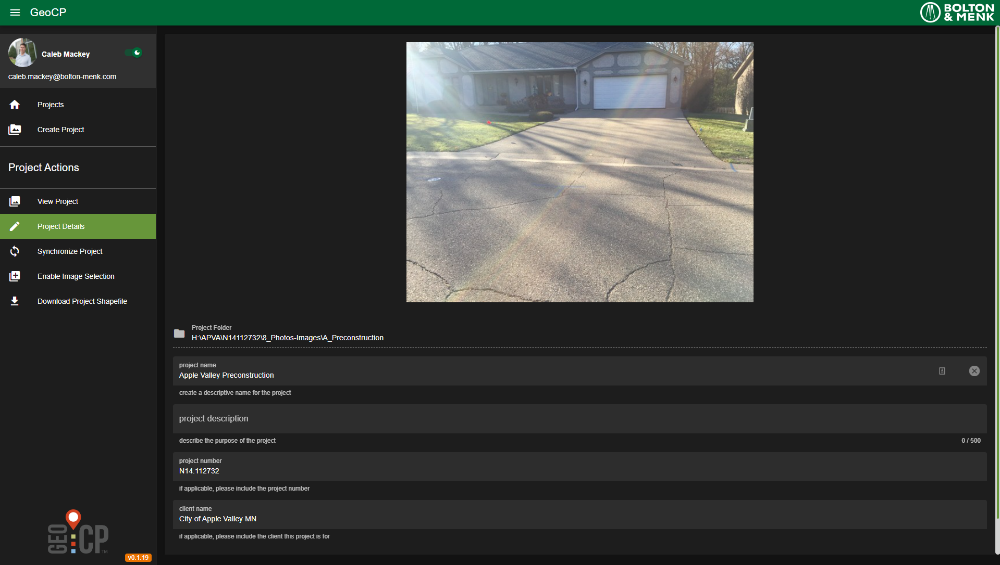
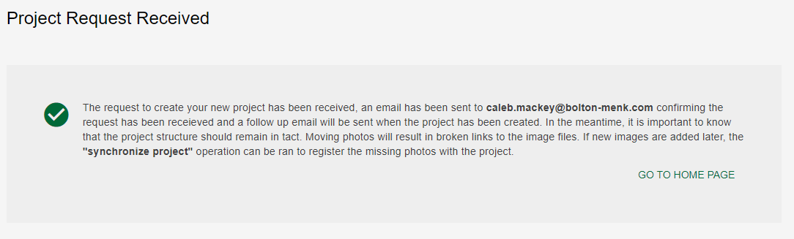
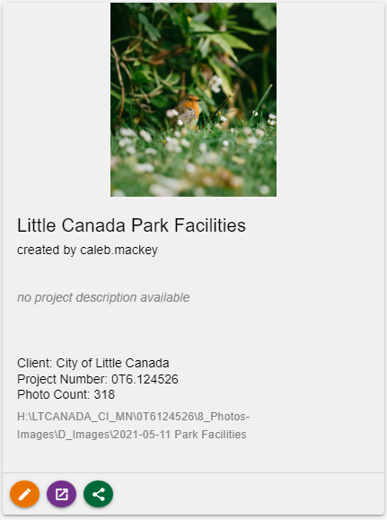
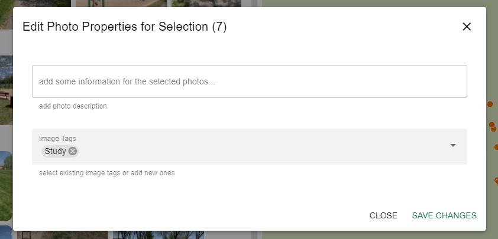
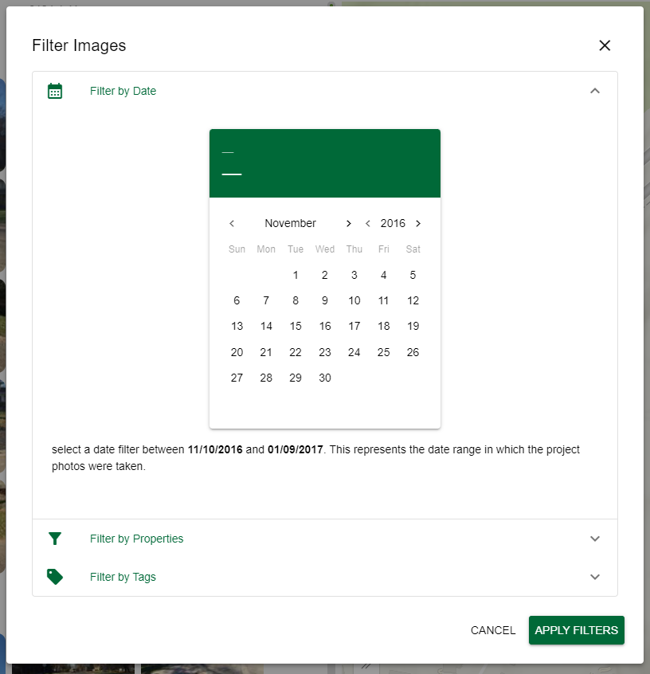
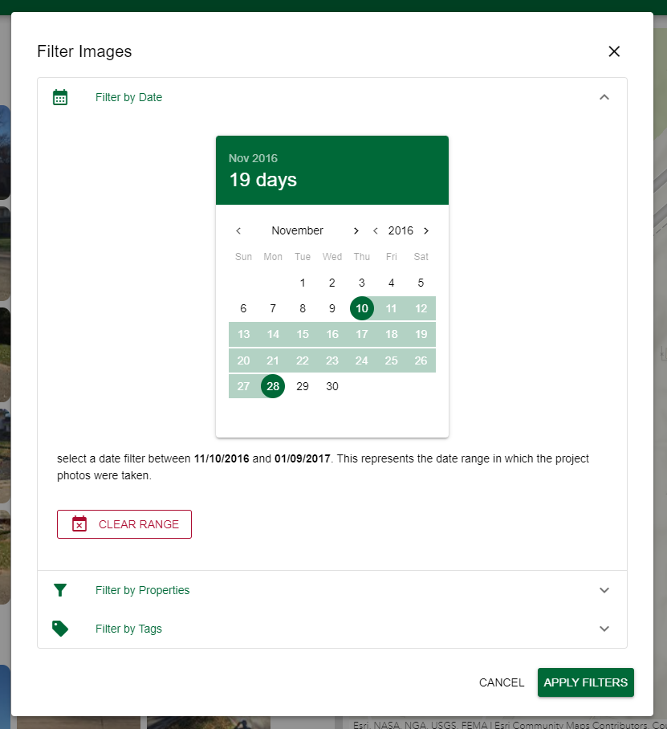
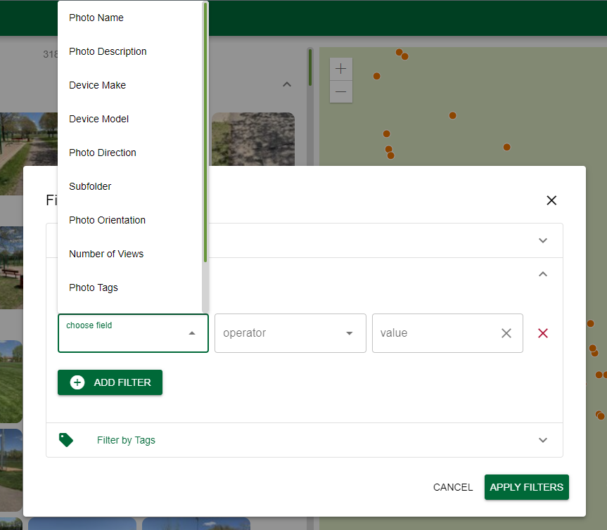
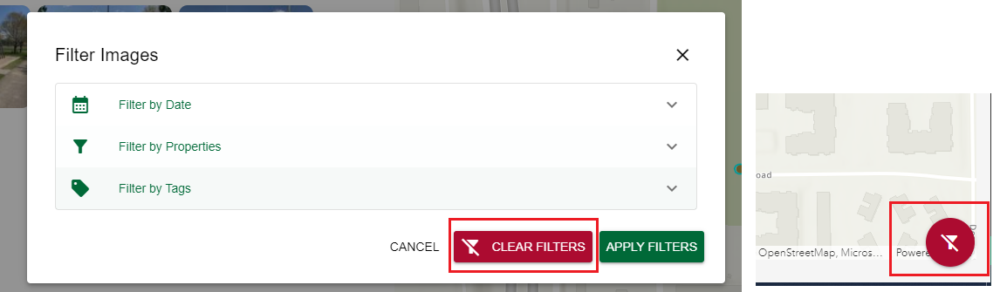

# GeoCP Tool (2022 Update)

User Guide

This tool will allow a user to specify a folder to display photos
contained within in a catalog style viewer as well as a map view
(**location services must be enabled when taking photos**). This tool
can locate all photos by recursively checking any subfolders in the
parent directory. This results in an application that can be used to
view the photos within the folder structure that can easily be shared
with via sending a link to the public viewer with an access token. The
application can also be ran in place on any of our server locations and
still have the benefit of accessing very small thumbnail images to
greatly reduce the amount of time images must render. Any past projects
can be viewed again at any time from the web application.

## Using the Application

1.  Launch the application from the
    [Garage](https://boltonmenk.sharepoint.com/sites/BusinessDevelopment/SitePages/GeoCP%E2%84%A2.aspx)

2.  When accessing internally, you will be required to login using your
    domain login (do not need to include the “bolton-menk\\”) or email
    address.

3.  Once you have logged in, you will be taken to the “Projects” home
    page. This will show a list of registered GeoCP projects. By
    default, only your projects will be shown unless you have never
    created one before:  
    

4.  You can view all public projects by toggling off the “show my
    projects” switch in the upper right:  
      
      
    Getting to know the “Project Card”:  
    

## Viewing a Project

> You can view a project by clicking on the project’s banner image or
> the purple button on the bottom of a project card. This will open a
> side-by-side view of the photo thumbnails on the left which can be
> collapsed by subfolder and a map view on the right.  
>  style="width:5.98215in;height:3.39947in"
> alt="Graphical user interface, application Description automatically generated" />
>
> **Note**: on mobile, a tabbed view will be shown instead where you can
> switch back and forth between the photo and map views:
>
>  style="width:4.13633in;height:4.37098in"
> alt="A picture containing chart Description automatically generated" />

### Image Controls

There are a variety of actions that are available for each thumbnail
image. The first thing to note is that when hovering over an image an
icon will appear in the upper right corner of the thumbnail. If you see
an orange pin, that means the photo has location information and you can
zoom the feature on the map by clicking on the pin. Additionally, images
that have location information will highlight the location in cyan on
the map view when hovering over the image. Clicking on the orange pin
button will zoom the map the selected thumbnail

When there is no location information, a red pin is displayed indicating
the location is missing from the photo’s EXIF metadata (left image). If
logged in, you can click on this icon to manually set a location for the
image. This is discussed in the [Advanced
Usage](#manually-assigning-location-for-photos) section. Images that
have been manually placed will show an orange pin with an exclamation
point indicating it is an approximate location (right).

Clicking on an image will zoom to that image in the map view and open up
a large preview of the image. Clicking on the large preview will open
the full-size image in a new tab. If logged in, you can also add image
tags and/or a description for the photo to make it easily searchable.
This process is discussed in further detail in the [Advanced
Usage](#adding-image-tags) section.

### Map Controls

The map controls allow for some customization of the map and the photo
point behavior. By default, all projects that have 300 or more photos
will have feature clustering enabled. This can be turned off by using
the “Map Options” in the bottom left corner of the map:

For images that contain a direction heading in their EXIF metadata, you
can also display the photo points to show the direction the camera was
facing when the photo was taken. **Note**: Turning this option on will
automatically disable the clustering if it is turned on.

The basemap can also be adjusted using the “Basemap Widget” in the upper
right-hand corner:

### The Action Panel

The Action Panel serves as the toolbox for any project actions or to
help with general application navigation. There are specific contextual
actions that show up when working in a selected project:

The Action Panel can also be shown and hidden by hitting the hamburger
menu icon  in the upper left corner:

#### The View Project Page

This is the default project page where you can view the thumbnails along
with the map view.

#### The Project Details Page

The “Project Details” page allows you to update the details for a given
project. Things you are allowed to change are the banner image (gets
displayed on the Project cards on the home page), the project name,
description, Vision project number, and the client for this project.

To update he project banner image, click on the main image shown in the
“Project Details” page which will open a modal. Inside this window, you
can either drag and drop an image file or paste in a URL to an image.
The default banner image is the first image of the registered project.

Once you have selected an image to serve as the banner, you should see a
preview for it:

Hit the “Update Banner” button to save the changes. The new banner image
should be reflected in the Project Details page:

#### Synchronize Project

Sometimes new images are added to the file structure after a project has
already been created in GeoCP. In order to incorporate the new images,
there is a “Synchronize Project” button in the Action Panel that will
search the project folder structure on the server and automatically
upload missing images into GeoCP. Please note that this can be a very
time-consuming process and therefore gets ran in the background and an
email will be sent when the process has completed. When you hit the
button, you will be presented with this prompt and be sure to hit the
“Sync Project” button to proceed with the synchronization process:

Here is an example of the synchronization email. It should show the
number of new images found. You can also click on the “Take me to the
project” button in the email to open GeoCP to this project.

**Note**: it is very important to keep the project folder structure
intact on the file server. Moving files and folders around after a GeoCP
project has been created can result in unexpected behavior and cause the
project to be corrupted from a synchronization perspective.

#### Enable Image Selection

The “Enable Image Selection” button will turn on the image selection
mode, which will allow the user to select photos by checking the box in
the upper left-hand corner of the thumbnail images. These images then
get added to a selection and the points are highlighted in green on the
map. The user can then hit the “Tag Image Selection” button to start the
batch tagging operation. This is discussed in further detail in the
Advanced Usage section.

#### Download Shapefile

Hitting this button will package up all the photo points into a
shapefile which contains the full URLs to each photo in the attribute
table and will be downloaded into a zip file format. **Note: you may
need to enable popups in your browser in order to see the download.**

### Dark Mode

Dark mode is also supported in GeoCP. Viewing the application in dark
mode will provide an ideal viewing experience in low-light environments.
This can be toggled on and off in the Action Panel next to the user
profile information.

## Creating a new GeoCP Project

To create a new project, click on the “Create Project” button in the
Action Panel which will open a wizard to guide the user through the
process of creating a new project. The first step requires to paste in a
path to a folder somewhere on the **O:\\** or **H:\\** drive.

Once you have provided a folder path, hit the “Continue” button to add
the project details.

If possible, the application will try to glean the client name and
project number if those are present in the folder path. If there was a
valid project number in the path, a list of possible project names will
also be queried from Vision to help autofill this information. You will
also be able to provide your own custom name if a matching name from
Vision is not applicable.

Next you will be taken to step three which will allow you to set a
banner image. The banner image is the main image for a project and is
displayed on the project card in the home view. This step is optional
and if no image is added, it will default to using the first image from
the project.

If you do provide an image, a preview will be rendered here:

If you hit “Continue” here, you will be shown a summary of all the
project details for the new project. If everything looks correct, hit
“Create Project” to kick off the process.

When the project request has been made, you will be taken to the
“Project Request Received” page. You can return to the projects home
page by clicking the “Go To Home Page” button.

Because the number of files can vary by project, this task gets ran on
the server and will send an email indicating the project has been
received and is processing and another when it has finished and the
project is ready to be viewed.

Clicking on the “Take me to the project” link should open the project to
the internal application (requires VPN):

When going to the home page, you should see the new project card. If you
chose an image as the banner that should be displayed, otherwise the
first image of the project is used.

## Advanced Usage

### Adding Image Tags

Images that are registered with GeoCP can also be supplied with optional
data such as a description and even image tags. Adding a description
and/or image tags make these easily searchable and can also be grouped
together based on common tags.

Descriptions and image tags can be added to images one at a time from
the photo details modal window or by batch selection and tagging. At
this time, descriptions and tags can only be added by authenticated
users. Once a description and or tag has been added, be sure to hit he
“Save Changes” button.

Clicking on the **Enable Image Selection** button in the Action Panel
will put the project in selection mode where multiple images can be
selected at once for batch tagging.

Once you have selected some images by hitting the checkbox in the upper
left-hand corner, selected images will show up as green points on the
map (if they had location information). The selection count will show up
next to the **Tag Image Selection** button. To begin batch tagging,
click this button to apply a description and/or tags to the entire
selection.

Set the desired properties and click the Save Changes button to apply
the edits. Once the changes have been saved, these properties will be
available for filtering.

### Filtering

A subset of images can be filtered out using the **Filter Images**
button in the Action Panel. When clicking this button, a modal window
pops up with options to filter by date taken, properties, or by image
tags.

Filtering by a date range is useful for projects where photos were taken
over a long period of time. In these cases, when expanding the **Filter
by Date** section, the date ranges the photos were taken are displayed
at the bottom. This is done to help the user select valid dates so that
results are picked up in the selection:

Any added descriptions will be searchable in the **Filter by
Properties** options along with any other attributes from the images. A
date range can be selected by clicking on the calendar to set the start
and end dates:

The Apply Filters button can be clicked on to run the filters at this
point, or you can continue to add more property and tag filters.

To filter by properties, first use the dropdown to choose a field to
filter by

Next select the operator and provide a value. The operator dropdown
depends on the type of property being used:

In this example, we will filter only by the “Study” image tag we
provided for 7 photos.

Hitting the Apply Filters button will run the filter set. We should only
see the images we tagged earlier:

Filters can be cleared by hitting the Filter Images button again and
then hitting Clear Filters, or by hitting the red filter button in the
bottom right corner (only shows up when there are active filters
applied).

### Manually Assigning Location for Photos

In some cases, some of the photos in a project may have missing location
information due to one of the photographers not having location services
enabled while taking pictures with their phone or other device.

For these cases, locations can be manually assigned by authenticated
users clicking on the red map pin the upper right-hand corner of the
image thumbnail (these only show up on those that don’t have location):

A modal will then popup with instructions how to set the image location
by clicking on at the desired coordinates on the map view (clicking
**Cancel** will abort the process). Click **Ok** to continue.

This will enable the map view to receive a map click and the cursor will
change to a crosshair when hovering over the map. When you have found
the desired location for the image, simply left-click the mouse to set
the location:

A temporary point will show up on the map in red and a confirmation box
will pop up to accept the proposed location. Click **Ok** to save the
changes.

This will save the changes and hovering over the image again will allow
you to zoom to the “manually placed image” location:

## Sharing a Project

To share a project with a client, simply hit the green share button on
the project card. This will copy the link to the public viewer to the
clipboard.

This will provide a link to the public viewer and will also include a
public access token in the URL. The URL should not be altered as the
user will not be able to access without logging in if the public access
token is missing. Also, be aware that each project has its own unique
public access token, and the public access token for one project will
not work for another.

## Feedback and Changelog

This application has been developed by Bolton and Menk staff and
therefore ongoing maintenance will also be handled in house. As a user
of this application you can see the version number highlighted in orange
in the bottom of the Action Panel:

Bug fixes and issues are tracked with each version number. When hovering
over this version, a menu pops up with options to “Show Changelog”,
“Submit an Issue”, or “Submit a Feature Request”.

The **Show Changelog** button will open the public Github repository for
this project where you can see bug fixes and features with each version.
The **Submit an Issue** button will allow the user to submit a bug
encountered with the application. Reporting bugs will help improve the
performance and behavior of this application. The **Submit a Feature
Request** button will allow the user to request additional
functionality. Please note that to submit an issue or feature request
will require the user to sign into Github. Anyone can create a free
account or use OAuth to login with a service such as Google.
